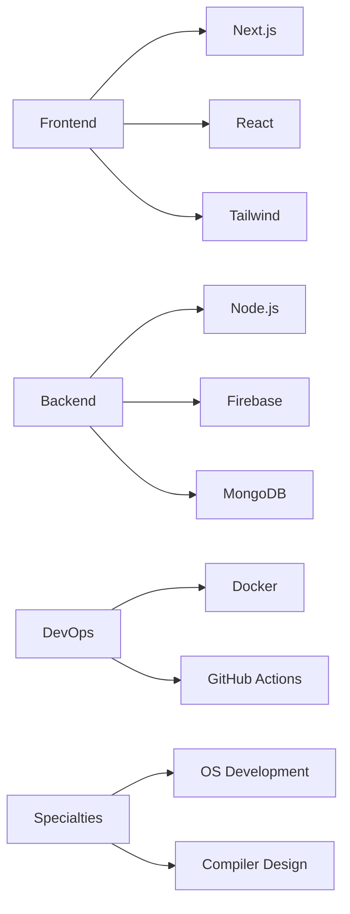

  

  

## 🔥 Team Matrix

<table align="center">
  <!-- ========= TOP ROW (CORE 4) ========= -->
  <tr>
    <td align="center" width="150">
      <a href="https://github.com/vikashgupta16">
        
         <b>Vikash Gupta</b> 🚀 Founder & Main Dev
      </a>
    </td>
    <td align="center" width="150">
      <a href="https://github.com/Dealer-09">
        
         <b>Archisman Pal</b> 🧠 Full-Stack Architect
      </a>
    </td>
    <td align="center" width="150">
      <a href="https://github.com/PixelPioneer404">
        
         <b>Rajbeer Saha</b> 🎨 UI/UX Lead
      </a>
    </td>
    <td align="center" width="150">
      <a href="https://github.com/Rouvik">
        
         <b>Rouvik Maji</b> 💻 OS/Compiler Dev
      </a>
    </td>
  </tr>

  <!-- ========= SECOND ROW ========= -->
  <tr>
    <td align="center" width="150">
      <a href="https://github.com/zin-web">
        
         <b>Zinnia Bag</b> 🌐 Frontend Dev
      </a>
    </td>
    <td align="center" width="150">
      <a href="https://github.com/reZero404">
        
         <b>Devjit</b> 🔙 Backend Dev
      </a>
    </td>
    <td align="center" width="150">
      <a href="https://github.com/dakiyaanoosi">
        
         <b>Avinish Kr Tripathi</b> 🧩 DSA
      </a>
    </td>
    <td align="center" width="150">
      <a href="https://github.com/2b-adrix">
        
         <b>Aditya Kr Mishra</b> 📱 App Dev
      </a>
    </td>
  </tr>

  <!-- ========= THIRD ROW ========= -->
  <tr>
    <td align="center" width="150">
      <a href="https://github.com/rupampramanik05">
        
         <b>Rupam Pramanik</b> 🌟 Frontend Dev
      </a>
    </td>
    <td align="center" width="150">
      <a href="https://github.com/DebugZero0">
        
         <b>Ankan Nandi</b> 🔧 DSA
      </a>
    </td>
  </tr>
</table>

## 🛠️ Active Projects

| Project | Description | Status | Tech Stack |
|---------|-------------|--------|------------|
| [CodeBattle ⚔️](/) | Real-time coding duels with leaderboard | 🚀 Active |   |
| [AIMS 2.0 📈](/) | Scalable student information platform | 🔄 Scaling |   |
| [PragatiPath 🌾](/) | Rural learning dashboard with multilingual support | 🆕 Beta |   |
| [Alpha Portal 🔐](/) | Team portal with GitHub integration | 🛠️ WIP |   |

## 🌟 Tech Stack

📜 License
MIT License

Note: This project and its components are intellectual property of Alpha Coders.

✅ Permitted: Forking & Contributing (with attribution)

❌ Restricted: Commercial use without explicit permission

📩 Contact: alpha4coders@gmail.com for collaborations

Join Us
Discord
Twitter

  
 
